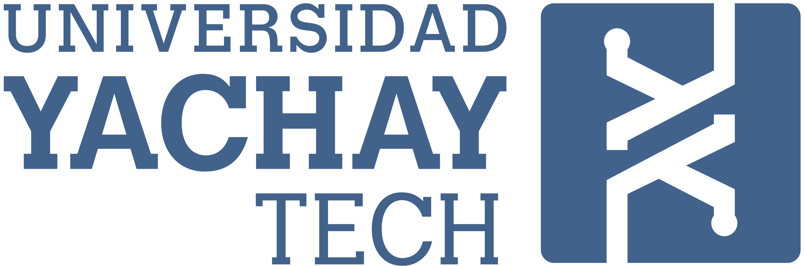
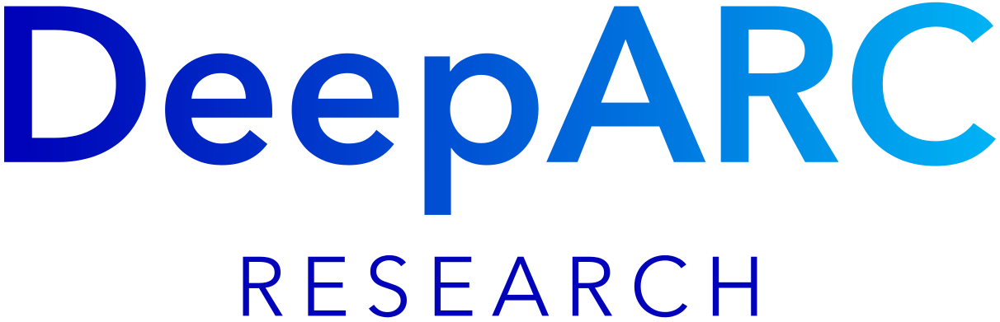

# Artificial Intelligence Notebooks

Welcome to the GitHub repository for Artificial Intelligence course. This repository is designed for the undergraduate degrees in Information Technology Engineering, Computer Science Engineering, and Mathematics from the School of Mathematical and Computational Sciences at Yachay Tech University. This 16-week course is designed to provide you with hands-on experience and in-depth understanding of fundamental AI topics. The notebooks include both coding exercises and project-based activities, and were created using Python 3 as the preferred language and Visual Studio Code as the integrated development environment (IDE).

## Table of Contents

1. [Unit 1: Introduction to Python](week1-2/)
   - **Objective**: Install Python, an IDE, and create a virtual environment. Familiarize yourself with Python basics such as lists, functions, packages, and Numpy.

2. [Unit 2: Supervised Learning with scikit-learn](week3-4/)
   - **Objective**: Understand logistic regression and delve into binary classification problems.

3. [Unit 3: Linear Classifiers on Python](week5-6/)
   - **Objective**: Explore the basics of neural networks and implement a simple feedforward neural network.

4. [Unit 4: Unsupervised Learning on Python](week7-8/)
   - **Objective**: Gain hands-on experience with various supervised learning algorithms like decision trees, support vector machines, and ensemble methods.

5. [Unit 5: Introduction to Deep Learning with Keras](week9-10/)
   - **Objective**: Dive into unsupervised learning techniques, including clustering and dimensionality reduction.

6. [Unit 6: Intermediate Deep Learning with PyTorch](week11-12/)
   - **Objective**: Learn the basics of reinforcement learning and implement a simple reinforcement learning agent.

7. [Unit 7: Generative AI and LLMs](week13-14/)
   - **Objective**: Understand the principles of deep learning and apply them to computer vision tasks.

8. [Unit 8: Prompt Engineering, Ethics, and Privacy in AI](week15/)
   - **Objective**: Explore the integration of machine learning models into the software development lifecycle using MLOps practices.


## Getting Started

1. Clone this repository to your local machine:

   ```bash
   git clone https://github.com/eugeniomorocho/Notebooks_ArtificialIntelligence.git

2. Navigate to the specific Notebook's directory:
   ```bash
   cd Notebooks_ArtificialIntelligence/NOTEBOOK_x/
   
3. Follow the instructions in the respective `README.md` file for each week's lab.


## Requirements

- Python 3.x
- IDE (Visual Studio Code, PyCharm, Spider, Jupyter Notebook, Google Colab, Kaggle Notebook, Amazon Sage Maker, etc.)
- Additional dependencies specified in each week's lab instructions

## Support and Feedback

If you encounter any issues or have suggestions for improvement, please [open an issue](https://github.com/eugeniomorocho/Notebooks_ArtificialIntelligence/issues). We appreciate your feedback!

Happy coding and exploring the exciting world of Artificial Intelligence!


***Manuel Eugenio Morocho-Cayamcela, PhD.***

<br/>
<br/>
$~~~$
